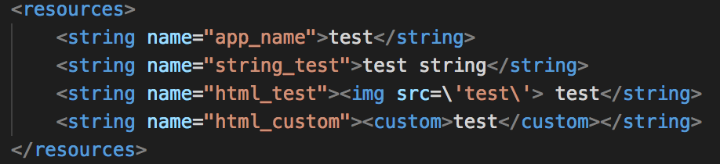
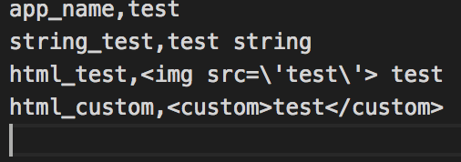

# strings.xml_to_csv
A groovy script to convert Android strings.xml resource file to csv file.

How to use
----------
```
$ groovy stringConverter.gsh [string.xml file path]
```

How to install Groovy
---------------------

http://groovy-lang.org/install.html

Example
-------

string.xml




string.csv




